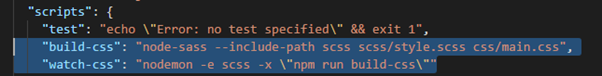

# Agregar SASS al proyecto
1. Iniciar Node
*Esta guia toma en cuenta que tienen instalado Node*
```
npm init
```

*nota: agregar los datos como autor, etc.*
2. Instalar
```
npm install -D node-sass nodemon
```

3. Opcional-Agregar las carpetas de node a .gitignore
```
node_modules
```


4. Editar el package.json con los paths adecuados
```
    "build-css": "node-sass --include-path scss scss/estilo.scss css/estilos.css",
    "watch-css": "nodemon -e scss -x \"npm run build-css\""
```

*nota: es un ejemplo, solo asegurens de hacer bien los paths y acuerdense de poner la coma en la linea 7.*

IMG: donde agregar el path 

5. Correr el compilardor
```
npm run watch-css
```

*nota: si estan agregando sass a un proyecto, guarden una copia del css, porque la primera vez va a compilar con el sass vacio sobrescribiendo el css a uno vacio*